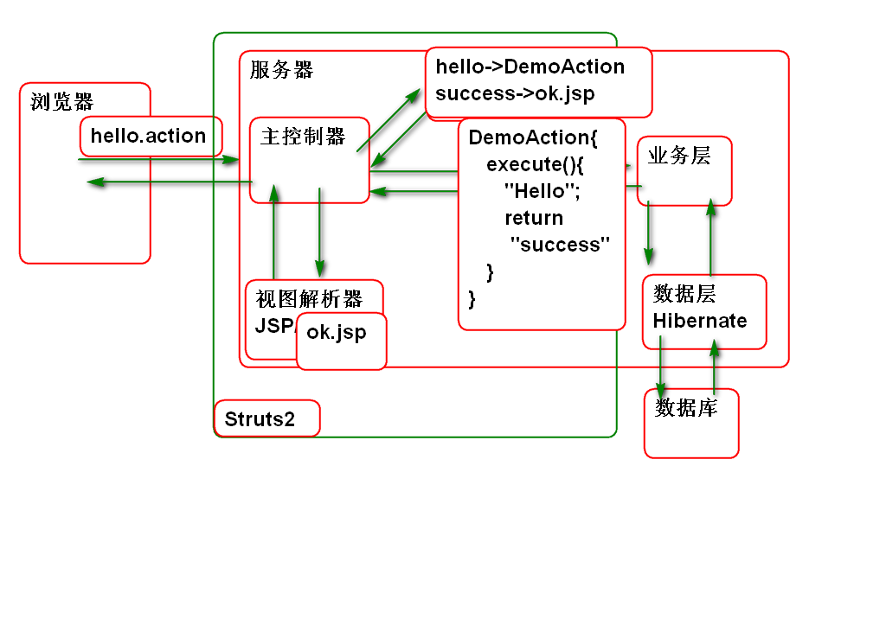
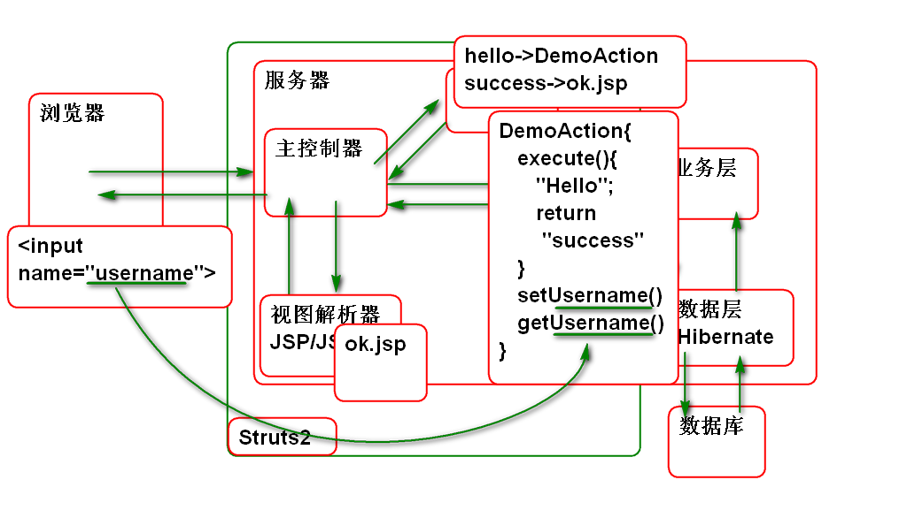
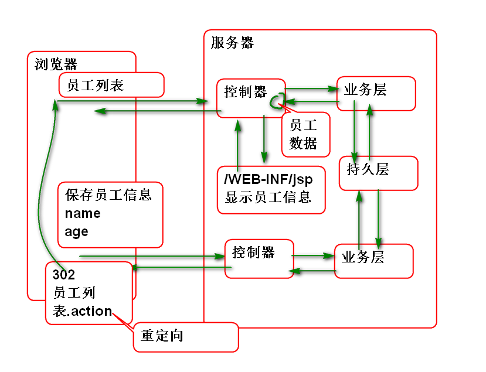

# SSH

SSH 组合为: 

	Spring 
	Struts2 
	Hibernate

SSM组合为: 
	
	Spring
	Spring MVC
	MyBatis

框架是什么? 封装了软件中经常使用的技术代码, 这样写项目时候就可以重用这些代码, 程序员就可以只关注软件的业务功能,不用关心繁琐的技术问题.

## MVC

MVC 是一种设计模式:

## Struts2 

Struts2 源自 XWorks(Web Works) 与 Struts1 没有关系.

### Struts环境搭建

SSH结构为:

搭建步骤:

1. 创建Maven项目, 导入Struts2 包:

		<dependency>
			<groupId>org.apache.struts</groupId>
			<artifactId>struts2-core</artifactId>
			<version>2.5.12</version>
		</dependency>

	> 需要生成部署描述文件 和 配置目标服务器运行环境.

2. 配置主控制器:

		<filter>
			<display-name>StrutsPrepareAndExecuteFilter</display-name>
			<filter-name>StrutsPrepareAndExecuteFilter</filter-name>
			<filter-class>org.apache.struts2.dispatcher.filter.StrutsPrepareAndExecuteFilter</filter-class>
		</filter>
		<filter-mapping>
			<filter-name>StrutsPrepareAndExecuteFilter</filter-name>
			<url-pattern>/*</url-pattern>
		</filter-mapping>

3. 添加Struts配置文件 struts.xml:

		<?xml version="1.0" encoding="UTF-8"?>
		<!DOCTYPE struts PUBLIC
			"-//Apache Software Foundation//DTD Struts Configuration 2.5//EN"
			"http://struts.apache.org/dtds/struts-2.5.dtd">
		<struts>
		</struts>
	
	> DTD 信息来自 struts-2.5.dtd

4. 部署测试.

### Hello World

原理: 

步骤:

1. 编写控制器类:

		/**
		 * 控制器类 
		 */
		public class DemoAction {
			/**
			 * 控制器 中的流程控制方法
			 * 在用户请求URL时候执行 
			 */
			public String execute(){
				System.out.println("Hello World!");
				//返回的值  success 代表jsp的视图名称
				return "success";
			}
		}

2. 编写 ok.jsp

		<%@ page contentType="text/html; charset=utf-8"
		    pageEncoding="utf-8"%>
		<html>
		<head>
		</head>
		<body>
			<h1>Hello World!</h1>
		</body>
		</html>

3. 配置 struts.xml

		<!-- http://localhost:8080/ssh/demo -->
		<package name="demo" namespace="/demo"
			extends="struts-default">
			<!-- 规定url和控制器方法的对应关系 -->
			<!-- http://localhost:8080 /ssh/demo/hello.action -->
			<action name="hello" 
				 class="ssh.day01.DemoAction"
				 method="execute">
				 <!-- 定义控制器方法的返回值
				   和jsp页面的对应关系 -->
				 <result name="success">
				 	/WEB-INF/ok.jsp
				 </result>
			</action>
		</package>

4. 测试:

		http://localhost:8080 /ssh/demo/hello.action

### 从浏览器到控制器传送参数

Struts2 封装了从浏览器到控制器传递功能, 只需要将 浏览器中的input 元素name属性的值与控制器的 bean 属性名称对应, 就可以在控制器中接收到参数值.

原理:

步骤:

1. 编写表单 demo.html:

		<!DOCTYPE html>
		<html>
		<head>
		<meta charset="UTF-8">
		<title>页面向控制器传送数据</title>
		</head>
		<body>
			<h1>利用表单提交数据</h1>
			<form action="demo/test.action"
				method="post">
				<label>用户名:</label>
				<input type="text" name="username"> 
				<label>年龄:</label>
				<input type="text" name="age"> 
				<input type="submit" value="提交">
			</form>	
		</body>
		</html>

2. 编写控制器:

		public class TestAction {
			
			private String username;
			private Integer age;
			public String getUsername() {
				return username;
			}
			public void setUsername(String username) {
				this.username = username;
			}
			public Integer getAge() {
				return age;
			}
			public void setAge(Integer age) {
				this.age = age;
			}
			
			public String execute(){
				//检查 浏览器 传递到控制器的数据
				System.out.println(username+","+age);
				return "success";
			}
		
		}

3. 配置 struts.xml

		<!--测试: 从表单传递数据到控制器 -->
		<action name="test" 
			class="ssh.day01.TestAction">
			<result name="success">
				/WEB-INF/ok.jsp
			</result>	
		</action>

4. 测试

### 从控制器向浏览器传送数据

Struts2 中控制器的Bean属性可以在JSP中直接使用 EL 表达式访问:

> 不仅仅可与传递字符串数据, 还可以专递包括集合类型的任何数据.

案例步骤:

1. 编写控制器:

		/**
		 * 测试: 从控制器向浏览器传送数据 
		 */
		public class MessageAction {
			private String message;
			public String getMessage() {
				return message;
			}
			public void setMessage(String message) {
				this.message = message;
			}
			
			public String execute(){
				message = "Hello World!";
				return "success";
			}
		}

2. 编辑msg.jsp显示信息
		
		<%@ page 
			contentType="text/html; charset=utf-8"
			pageEncoding="utf-8"%>
		<html>
		<head>
		</head>
		<body>
			<h1>控制器向浏览器传送数据</h1>
			
${message}

		</body>
		</html>

3. 配置struts.xml

		<!-- 测试 从控制器向浏览器传送数据 -->
		<action name="message"
			class="ssh.day01.MessageAction">
			<!-- dispatcher 结果类型表示
			控制器执行结束以后转发到 JSP 页面 -->
			<result type="dispatcher" name="success">
				/WEB-INF/msg.jsp
			</result>
		</action>

4. 测试:

## Result 的类型

Struts提供了丰富的结果类型, 每种结果类型都由一个类处理响应的逻辑, 如下代码是 struts-default.xml 文件中的定义:

        <result-types>
            <result-type name="chain" class="com.opensymphony.xwork2.ActionChainResult"/>
            <result-type name="dispatcher" class="org.apache.struts2.result.ServletDispatcherResult" default="true"/>
            <result-type name="freemarker" class="org.apache.struts2.views.freemarker.FreemarkerResult"/>
            <result-type name="httpheader" class="org.apache.struts2.result.HttpHeaderResult"/>
            <result-type name="redirect" class="org.apache.struts2.result.ServletRedirectResult"/>
            <result-type name="redirectAction" class="org.apache.struts2.result.ServletActionRedirectResult"/>
            <result-type name="stream" class="org.apache.struts2.result.StreamResult"/>
            <result-type name="velocity" class="org.apache.struts2.result.VelocityResult"/>
            <result-type name="xslt" class="org.apache.struts2.views.xslt.XSLTResult"/>
            <result-type name="plainText" class="org.apache.struts2.result.PlainTextResult" />
            <result-type name="postback" class="org.apache.struts2.result.PostbackResult" />
        </result-types>

> 默认情况下的result 其类型为 dispatcher, 规则为转发.

### redirect 重定向

这个类型用于重定向到其他的URL:

案例步骤:

1. 编写控制器:

		/**
		 * 测试: 重定向
		 */
		public class DocAction {
			public String execute(){
				System.out.println("DocAction");
				return "success";
			}
		}

2. 配置 struts.xml:

		<!-- 测试重定向类型结果 -->
		<action name="doc" class="ssh.day01.DocAction">
			<result name="success" type="redirect">
				http://doc.tedu.cn
				<!-- 
				<param name="location">
					http://doc.tedu.cn	
				</param>  -->		
			</result>
		</action>	

3. 测试

### redirectAction 重定向到其他控制器

Struts2 支持重定向到其他控制器:

案例步骤:

1. 编写控制器

		/**
		 * 测试: 重定向到其他Action 
		 */
		public class TouchAction {
			public String execute(){
				System.out.println("TouchAction");
				return "ok";
			}
		}

2. 配置

		<!-- 重定向到其他控制器 -->
		<action name="touch" 
			class="ssh.day01.TouchAction">
			<result name="ok"
				type="redirectAction">
				hello
			</result>	
		</action>

3. 测试

### stream 类型结果, 用于下载资源

Http协议支持下载: [http://doc.tedu.cn/rfc/rfc2616.txt](http://doc.tedu.cn/rfc/rfc2616.txt)

原理:

案例步骤:

1. 编写控制器:

		/**
		 * 下载图片到浏览器 
		 */
		public class ImageAction {
			private InputStream img;
			public InputStream getImg() {
				return img;
			}
			public void setImg(InputStream img) {
				this.img = img;
			}
			
			public String execute() throws IOException{
				byte[] png = createPng();
				//将byte数组作为流读取
				img=new ByteArrayInputStream(png);
				return "success";
			}
			
			private byte[] createPng() 
						throws IOException{
				BufferedImage img = 
					new BufferedImage(200,100,
					BufferedImage.TYPE_3BYTE_BGR);
				img.setRGB(100, 50, 0xffff00);
				ByteArrayOutputStream out =
					new ByteArrayOutputStream();
				ImageIO.write(img, "png", out);
				out.close();
				byte[] data = out.toByteArray();
				return data;
			}
		}
		

2. 配置:

		<!-- 下载图片到 浏览器  -->
		<action name="img"
			class="ssh.day01.ImageAction">
			<result name="success" type="stream">
				<param name="contentType">
					image/png
				</param>
				<param name="inputName">
					img
				</param>
				<param name="contentDisposition">
					attachment;filename="img.png"	
				</param>
			</result>	
		</action>

3. 测试:

## 作业

1. 搭建Struts2 开发环境
2. 测试 HelloWorld!
3. 测试 重定向
4. 实现动态图片下载功能

	