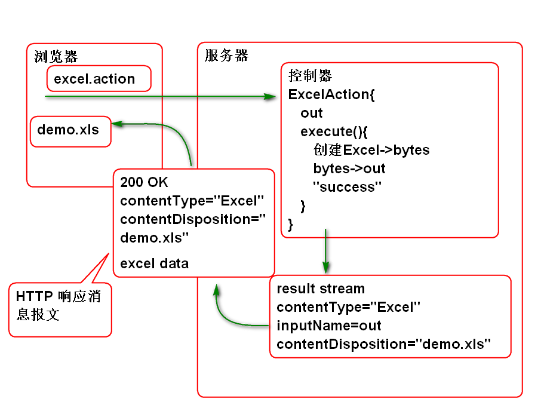

# SSH

## Struts2

### Stream Result Excel下载

Stream类型的Result支持任何类型数据的下载, 也支持Excel类型的下载, 可以利用POI, 产生Excel数据, 下载到客户端.

原理:

步骤:

1. 导入Apache POI API

		<!-- POI 用于生成 Excel 文件 -->
		<dependency>
			<groupId>org.apache.poi</groupId>
			<artifactId>poi</artifactId>
			<version>3.16</version>
		</dependency>

2. 编写控制器:

		/**
		 * 动态下载Excel文件 
		 *
		 */
		public class ExcelAction {
			
			private InputStream out;
			
			public InputStream getOut() {
				return out;
			}
			public void setOut(InputStream out) {
				this.out = out;
			}
			
			public String execute() throws IOException{
				byte[] excel = createExcel();
				out =new  ByteArrayInputStream(excel);
				return "success";
			}
		
			private byte[] createExcel() throws IOException {
				//创建工作表(Excel 文件)
				HSSFWorkbook workbook = 
						new HSSFWorkbook();
				//创建 工作表
				HSSFSheet sheet =
					workbook.createSheet("Hello");
				//在工作表中添加一行数据
				HSSFRow head=sheet.createRow(0);
				//在表头里面插入3个格子
				HSSFCell c1=head.createCell(0);
				HSSFCell c2=head.createCell(1);
				HSSFCell c3=head.createCell(2);
				c1.setCellValue("编号");
				c2.setCellValue("姓名");
				c3.setCellValue("年龄");
				//插入数据
				HSSFRow row=sheet.createRow(1);
				c1=row.createCell(0);
				c2=row.createCell(1);
				c3=row.createCell(2);
				c1.setCellValue(1);
				c2.setCellValue("Tom");
				c3.setCellValue(5);
				//将工作簿写到文件中
				ByteArrayOutputStream out=
					new ByteArrayOutputStream();
				workbook.write(out);
				workbook.close();
				out.close();
				return out.toByteArray();
			}
		}
		

3. 配置 struts.xml

		<!-- 下载 Excel  -->
		<action name="excel"
			class="ssh.day02.ExcelAction">
			<result name="success" type="stream">
				<param name="contentType">
					application/vnd.ms-excel
				</param>
				<param name="inputName">
					out
				</param>
				<param name="contentDisposition">
					attachment;filename="demo.xls"	
				</param>
			</result>	
		</action>
		
5. 测试:

		http://localhost:8080/ssh/demo/excel.action

6. 在网页中使用下载链接, download.html

		<!DOCTYPE html>
		<html>
		<head>
		<meta charset="UTF-8">
		<title>下载资料</title>
		</head>
		<body>
			<h1>下载资料</h1>
			

				下载<a href="demo/img.action">照片</a>
			

			

				下载<a href="demo/excel.action">Excel</a>
			

			

				<input type="button" 
					value="下载" onclick="download()">
			

		</body>
		
		</html>

### Json Result

struts2-json-plugin 提供了 Json类型结果, 在插件中包含文件 struts-plugin.xml, 其中包含:

    <package name="json-default" extends="struts-default">

        <result-types>
            <result-type name="json" class="org.apache.struts2.json.JSONResult"/>
            <result-type name="jsonActionRedirect" class="org.apache.struts2.json.JSONActionRedirectResult"/>
        </result-types>
	...

可以看到 继承 json-default 就可以获得 json 类型的Result.

JSON Result 默认规则是: 将控制器的全部Bean属性序列化为JSON对象属性返回到浏览器

测试步骤:

1. 导入 struts2-json-plugin

		<!-- JSON 插件 -->
		<dependency>
		  <groupId>org.apache.struts</groupId>
		  <artifactId>struts2-json-plugin</artifactId>
		  <version>2.5.12</version>
		</dependency>

2. 编写控制器:

		public class JsonAction {
			private String name;
			private int age;
			private String[] names;
			public String getName() {
				return name;
			}
			public void setName(String name) {
				this.name = name;
			}
			public int getAge() {
				return age;
			}
			public void setAge(int age) {
				this.age = age;
			}
			public String[] getNames() {
				return names;
			}
			public void setNames(String[] names) {
				this.names = names;
			}
			
			public String execute(){
				System.out.println("Json Result");
				name = "Tom";
				age = 10;
				names = new String[]{"Andy","Mac"};
				return "success";
			}
			
		}

3. 配置 struts.xml

		<package name="test" namespace="/test"
			extends="json-default">
			<!-- 将控制器的全部属性转换为JSON属性
			发送到浏览器 -->
			<action name="json" 
				class="ssh.day02.JsonAction">
				<result name="success" type="json"/>	
			</action>
		</package>

	> 注意: 需要从 json-default 继承才能获得 json 类型Result.

4. 测试:

		http://localhost:8080/ssh/test/json.action

默认的JSON类型结果会造成输出结果范围太大, 一般建议控制输出一个属性:

案例:

1. 配置 struts.xml

		<!-- 将控制器中的一个属性发送到客户端 -->
		<action name="json2" class="ssh.day02.JsonAction">
			<result name="success" type="json">
				<!-- root 属性用于设定将发送的属性名 -->
				<param name="root">
					names
				</param>
			</result>
		</action>
	
	> 注意: 属性root用于指定控制器中需要发送的Bean属性名称.
	> 注意: 这里重用了 JsonAction 控制器.

2. 测试

		http://localhost:8080/ssh/test/json.action

一般情况下,可以将需要发送的数据打包为 JsonResult类型的对象, 一起发送到客户端:

案例:

1. 编写 JsonResult

		/**
		 * 值对象:VO(Value Object) 
		 * 1)封装控制层相关方法返回的数据 
		 * 2)统一服务端相关方法返回的数据格式
		 */
		public class JsonResult {
			public static final int SUCCESS = 1;
			public static final int ERROR = 0;
			/** 状态:(SUCCESS,ERROR) */
			private int state;
			/** 状态信息 */
			private String message;
			/** 具体数据 */
			private Object data;
		
			public JsonResult() {
				state = SUCCESS;
			}
		
			public JsonResult(String message) {
				this();
				this.message = message;// 例如 insert ok,update ok
			}
		
			public JsonResult(Object data) {
				this();
				this.data = data;
			}
		
			public JsonResult(Throwable exp) {
				state = ERROR;
				this.message = exp.getMessage();
			}
		
			public int getState() {
				return state;
			}
		
			public String getMessage() {
				return message;
			}
		
			public Object getData() {
				return data;
			}
		}	

2. 编写控制器
		
		/**
		 * 将控制器中jsonResult属性发送到客户端 
		 */
		public class JsonResultAction {
			private JsonResult jsonResult;
			
			public JsonResult getJsonResult() {
				return jsonResult;
			}
			public void setJsonResult(JsonResult jsonResult) {
				this.jsonResult = jsonResult;
			}
			
			public String execute(){
				String[] names = {"熊大", "熊二"};
				jsonResult = new JsonResult(names);
				return "success";
			}
		}

3. 配置 struts.xml

		<!-- 将 JsonResult 属性发送到客户端 -->
		<action name="json3"
			class="ssh.day02.JsonResultAction">
			<result name="success" type="json">
				<param name="root">
					jsonResult				
				</param>
			</result>	
		</action>

4. 测试

		http://localhost:8080/ssh/test/json3.action

## Struts2 与 Spring 整合

Struts2 提供了 Struts2-spring-plugin插件, 导入插件后 Struts2 可以利用Spring容器作为工厂创建控制器对象的实例.

整合步骤:

1. 导入Struts2-spring-plugin插件:

		<dependency>
		  <groupId>org.apache.struts</groupId>
		  <artifactId>struts2-spring-plugin</artifactId>
		  <version>2.5.12</version>
		</dependency>	
		
	> 导入这个插件的时候,会自动依赖导入Spring的包.

2. 在web.xml中配置监听器, 初始化Spring容器:
	
		<listener>
			<listener-class>org.springframework.web.context.ContextLoaderListener</listener-class>
		</listener>
		<context-param>
			<param-name>contextConfigLocation</param-name>
			<param-value>classpath:conf/spring-*.xml</param-value>
		</context-param>

	> 其中: contextConfigLocation 参数是ContextLoaderListener的参数, 用于获取Spring容器的初始化配置文件.

3. 添加Spring的配置文件 conf/spring-struts.xml:

		<?xml version="1.0" encoding="UTF-8"?>
		<beans default-lazy-init="true"
		    xmlns="http://www.springframework.org/schema/beans" 
		    xmlns:p="http://www.springframework.org/schema/p"
		    xmlns:xsi="http://www.w3.org/2001/XMLSchema-instance" 
		    xmlns:context="http://www.springframework.org/schema/context"
		    xmlns:tx="http://www.springframework.org/schema/tx"
		    xmlns:mvc="http://www.springframework.org/schema/mvc"
		    xsi:schemaLocation="  
		       http://www.springframework.org/schema/beans   
		       http://www.springframework.org/schema/beans/spring-beans-4.1.xsd  
		       http://www.springframework.org/schema/mvc   
		       http://www.springframework.org/schema/mvc/spring-mvc-4.1.xsd   
		       http://www.springframework.org/schema/tx   
		       http://www.springframework.org/schema/tx/spring-tx-4.1.xsd   
		       http://www.springframework.org/schema/context  
		       http://www.springframework.org/schema/context/spring-context-4.1.xsd" >  
		
		</beans>

	> 注解: Schema 文件的版本必须与Spring版本一致!!

4. 启动容器测试

### Spring + Struts2 Hello World!

整合Spring插件使用以后, 利用Spring管理控制器Bean组件, 在Struts2 配置文件的class属性上使用Spring 的BeanID就可以使用Spring管理的控制器Bean组件了.

案例:

1. 添加控制器Bean组件

		@Controller
		public class TestAction {
			public String execute(){
				System.out.println("testAction");
				return "success";
			}
		}

2. 在Spring配置文件中配置组件扫描: spring-struts.xml

		<context:component-scan base-package="ssh.day02"/>

3. 配置struts.xml:

		<!-- 使用由 Spring 管理的控制器组件 
			class的值是Spring中的BeanID-->
		<action name="test" class="testAction">
			<result name="success">
				/WEB-INF/ok.jsp
			</result>
		</action>

4. 测试:

		http://localhost:8080/ssh/test/test.action

## Hibernate

Hibernate: 冬眠, 将对象的数据长久的保存到数据库

ORM 对象关系映射: 解决对象数据到关系型数据库的自动映射存储.

	user = new User();
	session.save(user);
	session.delete(user);

> Hibernate 的 Session 接口提供了 CRUD 方法.

