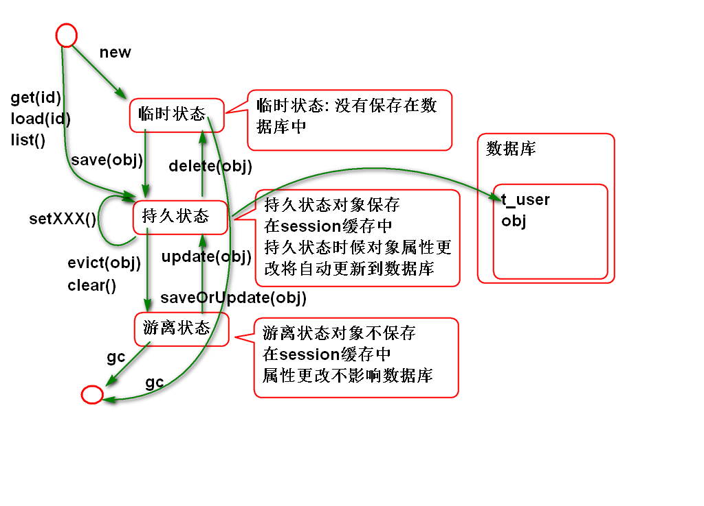
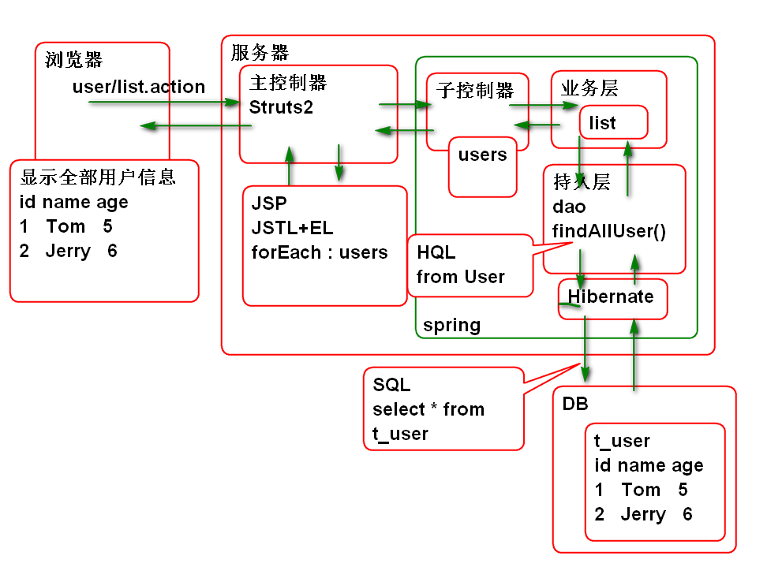
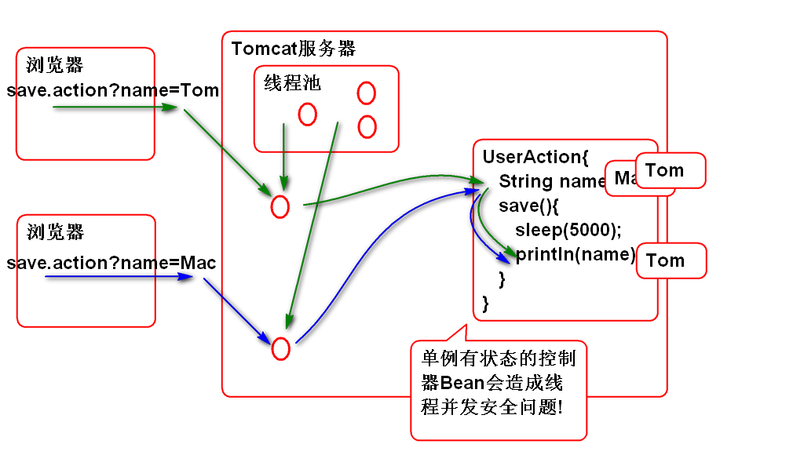
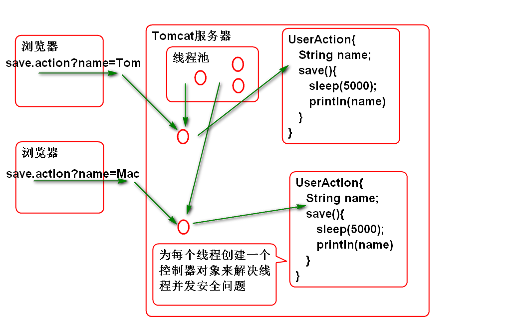

# SSH

## Hibernate

### Hibernate CRUD

Hibernate 提供实体对象的CRUD方法, 这些方法会自动生成相应的SQL, 在执行DML方法时候需要使用 事务:

案例:

	@Test
	public void testSaveUser(){
		Transaction tx = session.beginTransaction();
		long now=System.currentTimeMillis();
		//创建User对象,调用save()保存到数据库中
		User user=new User(
			1,"Tom",5,100.0,new Timestamp(now));
		session.save(user);
		tx.commit();
	}

	@Test
	public void testGet(){
		//测试 查询方法 get
		int id=1;
		User user=
			(User)session.get(User.class, id);
		System.out.println(user);
	}
	
	@Test
	public void testUpdate(){
		Transaction tx=session.beginTransaction();
		User user=(User)session.get(
				User.class, 1);
		user.setName("范传奇"); 
		session.update(user);
		user=(User)session.get(
				User.class, 1);
		System.out.println(user);
		tx.commit();
	}
	
	@Test
	public void testDelete(){
		Transaction tx=session.beginTransaction();
		User user=(User)session.get(
				User.class, 1);
		System.out.println(user);
		session.delete(user); 
		System.out.println(user); 
		tx.commit();
	}
	
	@Test
	public void testAddDat(){
		long now=System.currentTimeMillis();
		Transaction tx = session.beginTransaction();
		User user=new User(
			1,"Tom",20,200.0,new Timestamp(now));
		session.save(user);
		user=new User(
			2,"Jerry",5,100.0,new Timestamp(now));
		session.save(user);
		user=new User(
			3,"Mac",20,200.0,new Timestamp(now));
		session.save(user);
		tx.commit();
	}

### HQL

Hibernate中不用使用SQL, 查询使用可以使用HQL, 其语法与SQL类似:

1. 如果是查询全部属性数据, 则可以省略select子句
2. 表名替换为其对应的实体类名
3. 列名替换为其对应的实体属性名

案例:

	@Test
	public void testFindAll(){
		//sql: select * from t_user
		//HQL: from User
		//1. 如果是查询全部属性数据, 
		//   则可以省略select子句
		//2. 表名替换为其对应的实体类名
		//3. 列名替换为其对应的实体属性名
		
		String hql="from User";
		//利用Query接口执行HQL
		Query query=
			session.createQuery(hql);
		List<User> list=query.list();
		for (User user : list) {
			System.out.println(user); 
		}
	}
	
	@Test
	public void testFindByAge(){
		//sql: select * from t_user 
		//     where t_age=?
		//hql: from User where age=?
		String hql="from User where age=?";
		Query query=session.createQuery(hql);
		query.setInteger(0, 20);
		List<User> list=query.list();
		for (User user : list) {
			System.out.println(user); 
		}
	}
	
	@Test
	public void testFindMapList(){
		//sql: select t_id, t_name 
		//     from t_user where t_age=?
		//     order by t_name
		//hql: select new map(id as id, 
		//            name as name) 
		//     from User where age=?
		//     order by name
		String hql="select new map(id as id, "
				+ "name as name) "
				+ "from User where age=:age "
				+ "order by name";
		Query query=session.createQuery(hql);
		//按照名称替换参数
		query.setInteger("age", 20);
		List<Map<String, Object>> list=
				query.list();
		for (Map<String, Object> map : list) {
			System.out.println(map);
		}
	}

### Hibernate 对象生存周期管理

Hibernate 管理的对象有三种生存周期状态:

测试持久状态:

	@Test
	public void testSave(){
		long now=System.currentTimeMillis();
		Transaction tx=session.beginTransaction();
		User user=new User(5, "范老师",
			20, 3000.0, new Timestamp(now));
		//临时状态
		session.save(user);
		//持久状态
		user.setSalary(100.0);
		user.setAge(50);
		//清理session,执行全部SQL
		session.flush();
		tx.commit();
		//session.evict(object);
	}

测试游离状态:

	@Test
	public void testEvict(){
		long now=System.currentTimeMillis();
		Transaction tx=session.beginTransaction();
		User user=new User(
				6, "李老师", 20, 200.0,
				new Timestamp(now));
		session.save(user);
		//持久状态
		session.flush();//执行可能的sql
		session.evict(user);//将user从session中清除
		//游离状态
		user.setAge(50);
		session.flush();//执行可能的sql
		tx.commit();
	}

测试各种状态:

	@Test
	public void testLiftCircle(){
		Transaction tx=session.beginTransaction();
		User user=
			(User)session.load(User.class,1);
		System.out.println(user);
		//持久状态
		user.setAge(50);
		session.flush();
		session.clear();
		//游离状态
		user.setAge(30);
		session.flush();
		session.update(user);
		//持久状态
		session.flush();
		session.delete(user);
		//临时状态
		System.out.println(user);
		tx.commit();
	}

### Spring 整合 Hibernate

Spring 提供了一个包 spring-orm 对 Hibernate进行支持, 简化了Hibernate的对象管理:

1. LocalSessionFactoryBean 简化 SessionFactory的管理
2. HibernateTemplate 简化了 Sesison 的使用 
3. HibernateTransactionManager 简化了事务处理.

> spring-orm 依赖 DataSource

整合步骤:

1. 导入 spring-orm 和 DataSource

		<!--添加alibaba的druid连接池依赖 暂且可以将DRUID理解为增强版DBCP -->
		<dependency>
			<groupId>com.alibaba</groupId>
			<artifactId>druid</artifactId>
			<version>1.0.23</version>
		</dependency>
		<dependency>
			<groupId>org.springframework</groupId>
			<artifactId>spring-orm</artifactId>
			<version>4.1.6.RELEASE</version>
		</dependency>
	
	> 注意: spring-orm 的版本要与 spring 的版本一致

2. 添加数据库连接参数文件 conf/jdbc.properties

		jdbc.driver=com.mysql.jdbc.Driver
		jdbc.url=jdbc:mysql://localhost:3306/ssh
		jdbc.username=root
		jdbc.password=root
		jdbc.initialSize=5
		jdbc.maxActive=50
		jdbc.minIdle=0
		jdbc.maxWait=60000
		jdbc.druid.filters=
		jdbc.timeBetweenLogStatsMillis=60000 

3. 配置连接池 conf/spring-pool.xml

		<?xml version="1.0" encoding="UTF-8"?>
		<beans default-lazy-init="true"
		    xmlns="http://www.springframework.org/schema/beans" 
		    xmlns:p="http://www.springframework.org/schema/p"
		    xmlns:xsi="http://www.w3.org/2001/XMLSchema-instance" 
		    xmlns:context="http://www.springframework.org/schema/context"
		    xmlns:tx="http://www.springframework.org/schema/tx"
		    xmlns:mvc="http://www.springframework.org/schema/mvc"
		    xsi:schemaLocation="  
		       http://www.springframework.org/schema/beans   
		       http://www.springframework.org/schema/beans/spring-beans-4.1.xsd  
		       http://www.springframework.org/schema/mvc   
		       http://www.springframework.org/schema/mvc/spring-mvc-4.1.xsd   
		       http://www.springframework.org/schema/tx   
		       http://www.springframework.org/schema/tx/spring-tx-4.1.xsd   
		       http://www.springframework.org/schema/context  
		       http://www.springframework.org/schema/context/spring-context-4.1.xsd" >  
		
		   <!-- 加载jdbc.properties文件(一般加载多个文件时
		        可考虑使用此方式) ,回顾使用<util:properties>-->
		   <bean id="propertyConfigurer"  class="org.springframework.beans.factory.config.PropertyPlaceholderConfigurer">
				<property name="locations">
					<list>
						<value>classpath:conf/jdbc.properties</value>
					</list>
				</property>
		   </bean>
		   
		   
		  
		   <!-- 配置DRUID连接池(这个连接池的说明:
		   http://github.com 在搜索栏输入druid查找)
		     这个stat-filter 是一个可选的配置
		   -->
		   <bean id="stat-filter" class="com.alibaba.druid.filter.stat.StatFilter"
		    lazy-init="true">
		        <description>状态过滤器</description>
		         <!-- 通过slowSqlMillis用来配置SQL慢的标准 -->
		        <property name="slowSqlMillis" value="3000" />
		         <!-- 以日志形式输出执行效率慢的SQL -->
		        <property name="logSlowSql" value="true" />
		        <!-- 通过mergeSql属性，合并SQL -->
		        <property name="mergeSql" value="true" />
		   </bean>
		   <!--配置DruidDataSource连接池,其中可通过${key}获取properties文件中的值 -->
		   <bean id="dataSource" class="com.alibaba.druid.pool.DruidDataSource"
				destroy-method="close" init-method="init" lazy-init="true">
				<property name="driverClassName" value="${jdbc.driver}" />
				<property name="url" value="${jdbc.url}" />
				<property name="username" value="${jdbc.username}" />
				<property name="password" value="${jdbc.password}" />
				<!-- 初始化连接大小 -->
				<property name="initialSize" value="${jdbc.initialSize}" />
				<!-- 连接池最大数量 -->
				<property name="maxActive" value="${jdbc.maxActive}" />
				<!-- 连接池最小空闲 -->
				<property name="minIdle" value="${jdbc.minIdle}" />
				<!-- 获取连接最大等待时间 -->
				<property name="maxWait" value="${jdbc.maxWait}" />
				<!--配置了maxWait之后，缺省启用公平锁，并发效率会有所下降，如果需要可以通过配置useUnfairLock属性为true使用非公平锁。 -->
				<property name="useUnfairLock" value="true" />
				<property name="defaultReadOnly" value="false" />
				
				<!-- 通过配置StatFilter,打开监控台统计功能 -->
				<property name="proxyFilters">
					<list>
						<ref bean="stat-filter" />
					</list>
				</property>
				<property name="filters" value="${jdbc.druid.filters}" />
		     </bean>
		</beans>

4. 配置 Hibernate, conf/spring-hibernate.xml

		<?xml version="1.0" encoding="UTF-8"?>
		<beans default-lazy-init="true"
		    xmlns="http://www.springframework.org/schema/beans" 
		    xmlns:p="http://www.springframework.org/schema/p"
		    xmlns:xsi="http://www.w3.org/2001/XMLSchema-instance" 
		    xmlns:context="http://www.springframework.org/schema/context"
		    xmlns:tx="http://www.springframework.org/schema/tx"
		    xmlns:mvc="http://www.springframework.org/schema/mvc"
		    xsi:schemaLocation="  
		       http://www.springframework.org/schema/beans   
		       http://www.springframework.org/schema/beans/spring-beans-4.1.xsd  
		       http://www.springframework.org/schema/mvc   
		       http://www.springframework.org/schema/mvc/spring-mvc-4.1.xsd   
		       http://www.springframework.org/schema/tx   
		       http://www.springframework.org/schema/tx/spring-tx-4.1.xsd   
		       http://www.springframework.org/schema/context  
		       http://www.springframework.org/schema/context/spring-context-4.1.xsd" >  
		
			<!-- 管理 Hibernate4 SessionFactory -->
			<bean id="sessionFactory" class="org.springframework.orm.hibernate4.LocalSessionFactoryBean">
				<property name="dataSource"
					ref="dataSource"/>
				<property name="hibernateProperties">
					<props>
						<prop key="hibernate.dialect">
							org.hibernate.dialect.MySQL5Dialect
						</prop>
						<prop key="hibernate.show_sql">
							true
						</prop>
						<prop key="hibernate.format_sql">
							true
						</prop>
					</props>
				</property>
				<property name="mappingLocations" 
					value="classpath:mapping/*.xml"/>
			</bean>
			
			<!-- 配置HibernateTemplate -->
			<bean id="hibernateTemplate" class="org.springframework.orm.hibernate4.HibernateTemplate">
				<property name="sessionFactory"
					ref="sessionFactory"/>
			</bean>	
			<!-- 配置事务管理器 -->
			<bean id="txManager"  class="org.springframework.orm.hibernate4.HibernateTransactionManager">
				<property name="sessionFactory"
					ref="sessionFactory"/>
			</bean>
			<!-- 配置声明式事务 -->
			<tx:annotation-driven 
				transaction-manager="txManager"/>
		</beans>

5. 测试:

		public class ORMTestCase {
			ClassPathXmlApplicationContext ctx;
			SessionFactory factory;
			
			@Before
			public void init(){
				ctx=new ClassPathXmlApplicationContext(
					"conf/spring-pool.xml",
					"conf/spring-hibernate.xml");
				factory = ctx.getBean("sessionFactory",
						SessionFactory.class);
			}
			@After
			public void destory(){
				factory.close();
				ctx.close();
			}
		
			@Test
			public void testSession(){
				Session session=factory.openSession();
				User user = (User)session.get(
					User.class, 2);
				System.out.println(user);
				session.close();
			}
		}

### Hibernate DAO

HibernateTemplate 天生就是为DAO设计的! 天生为数据持久层设计.
HibernateTemplate 封装了Session对象, 提供了实体对象的CRUD操作, 简单的替代 Session的功能.

使用 HibernateTemplate:

1. 声明Dao接口 
		
		public interface UserDao {
			void saveUser(User user);
		}
		
2. 实现Dao接口:

		@Repository("userDao")
		public class UserDaoImpl implements UserDao {
			
			@Resource(name="hibernateTemplate")
			private HibernateTemplate template;
			
			@Transactional
			public void saveUser(User user) {
				template.save(user);
			}
		}

3. 配置dao组件扫描 spring-hibernate.xml

		<!-- 扫描dao组件 -->
		<context:component-scan base-package="cn.tedu.dao"/>

4. 测试:
		
		public class DaoTest {
			ClassPathXmlApplicationContext ctx;
			UserDao dao;
			
			@Before 
			public void init(){
				ctx = new ClassPathXmlApplicationContext(
				"conf/spring-pool.xml",
				"conf/spring-hibernate.xml");
				dao = ctx.getBean(
					"userDao",UserDao.class);
			}
			
			@After
			public void destory(){
				ctx.close();
			}
		
			@Test
			public void testSave(){
				long now = System.currentTimeMillis();
				User user=new User(8, "熊大", 
					8, 200.0, new Timestamp(now));
				dao.saveUser(user); 
			}
		}

## SSH 整合测试

SSH整合显示全部用户列表的原理:

实现步骤:

1. 编写 持久层方法 UserDao

		List<User> findAllUsers();

2. 实现持久层方法 UserDaoImpl

		@Transactional
		public List<User> findAllUsers() {
			String hql = "from User";
			return (List<User>)template.find(hql);
		}

3. 测试 DaoTest:

		@Test
		public void testFindAllUsers(){
			List<User> list=dao.findAllUsers();
			for (User user : list) {
				System.out.println(user); 
			}
		}

4. 编写业务层接口:

		public interface UserService {
			List<User> list();
		}

5. 实现业务层接口
		
		@Service("userService")
		@Transactional
		public class UserServiceImpl 
			implements UserService{
		
			@Resource
			private UserDao userDao;
			
			public List<User> list() {
				return userDao.findAllUsers();
			}
		}

6. 编写控制器类:
		
		@Controller
		@Scope("prototype")
		public class UserAction {
			
			@Resource 
			private UserService userService;
			
			private List<User> users = 
					new ArrayList<User>();
			public List<User> getUsers() {
				return users;
			}
			public void setUsers(List<User> users) {
				this.users = users;
			}
			
			public String list(){
				users = userService.list();
				return "success";
			}
		}

7. 编写 /WEB-INF/jsp/list.jsp 

		<%@ page  
			contentType="text/html; charset=utf-8"
		   pageEncoding="utf-8"%>
		<%@taglib prefix="c"  
			uri="http://java.sun.com/jsp/jstl/core"%>
		<!DOCTYPE html>
		<html>
		<head>
			<meta charset="utf-8">
		</head>
		<body>
			<h1>员工管理</h1>
			

				<table>
					<tr>
						<th>编号</th>
						<th>姓名</th>
						<th>年龄</th>
						<th>薪资</th>
					</tr>
					<c:forEach items="${users}" 
						var="user">
						<tr>
							<td>${user.id}</td>
							<td>${user.name}</td>
							<td>${user.age}</td>
							<td>${user.salary}</td>
						</tr>
					</c:forEach>
				</table>
			
	
		</body>
		</html>

	> 需要用到 JSTL 标签库,需要导入jstl

		<dependency>
			<groupId>jstl</groupId>
			<artifactId>jstl</artifactId>
			<version>1.2</version>
		</dependency>

8. 配置 struts.xml

		<package name="user" namespace="/user" 
			extends="json-default">
			<action name="list" class="userAction"
				method="list"> 
				<result name="success">
					/WEB-INF/jsp/list.jsp
				</result>
			</action>
		</package>

9. 开启业务层和控制器组件扫描:
	
		<context:component-scan 	
		  	base-package="cn.tedu.service"/>
		<context:component-scan 	
		  	base-package="cn.tedu.action"/>

10. 部署测试

		http://localhost:8080/ssh/user/list.action

### Struts2 控制器线程安全问题

原理:

面试题目: Struts2 中如何解决控制器并发安全性问题的? 

	答案: Struts2控制器是有状态的! 为每个用户请求创建一个控制器对象, 
	来解决并发安全问题, 在SSH整合时候使用@Scope("prototype")  
	

面试题目: Spring MVC 中如何解决控制器并发安全性问题的? 

	答案: 保持控制器是无状态的Bean, 就是:不要在控制器中定义读写变量
 
--------------------------

## 作业

1. 搭建SSH环境, 开发用户列表功能
2. 开发添加用户功能
2. 开发更新用户功能
