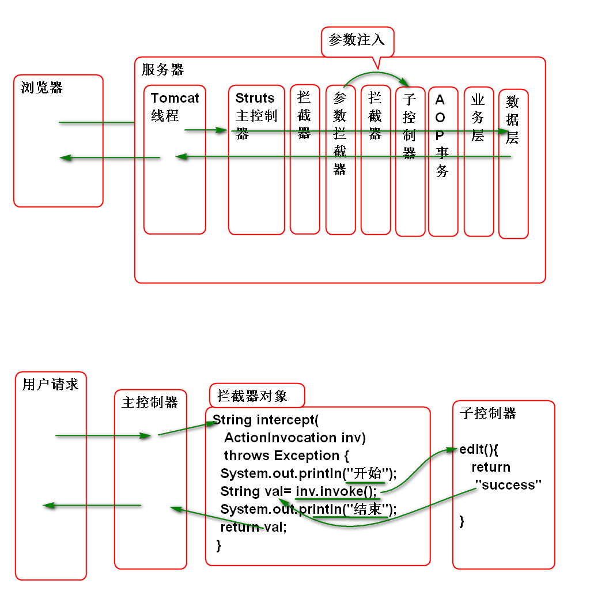

# SSH

## 添加用户功能

### 添加用户功能之显示添加用户界面:

1. 编写nav.jsp 封装网页导航条

		<%@ page 
		 	contentType="text/html; charset=utf-8"
		   pageEncoding="utf-8"%>
		   
			<h1>用户管理</h1>
			<!-- 导航菜单标签 nav  -->
			<nav>
				<a href="list.action">首页</a>
				<a href="add.action">添加用户</a>
			</nav>

2. 更新列表界面 list.jsp 添加导航条:

		<%@ page  
			contentType="text/html; charset=utf-8"
		   pageEncoding="utf-8"%>
		<%@taglib prefix="c"  
			uri="http://java.sun.com/jsp/jstl/core"%>
		<!DOCTYPE html>
		<html>
		<head>
			<meta charset="utf-8">
		</head>
		<body>
			<c:import url="/WEB-INF/jsp/nav.jsp"/>
			<h2>用户列表</h2>
			

				<table>
					<tr>
						<th>编号</th>
						<th>姓名</th>
						<th>年龄</th>
						<th>薪资</th>
						<th>功能</th>
					</tr>
					<c:forEach items="${users}" 
						var="user">
						<tr>
							<td>${user.id}</td>
							<td>${user.name}</td>
							<td>${user.age}</td>
							<td>${user.salary}</td>
							<td>
								<a href="edit.action?id=${user.id}">编辑</a>
							</td>
						</tr>
					</c:forEach>
				</table>
			
	
		</body>
		</html>

3. 编写添加用户的表单界面 adduser.jsp  

		<%@ page 
			contentType="text/html; charset=utf-8"
			pageEncoding="utf-8"%>
		<%@taglib prefix="c" 
			uri="http://java.sun.com/jsp/jstl/core" %>
		<!DOCTYPE html>
		<html>
		<head>
			<meta charset="utf-8">
		</head>
		<body>
			<c:import url="/WEB-INF/jsp/nav.jsp"/>
			<h2>添加用户</h2>
			<form action="save.action" method="post">
				

					<label>用户名</label>
					<input type="text" name="user.name"
						value="${user.name}">
					<c:if test="${type==1}">
						${message}
					</c:if>
				

				

					<label>年龄</label>
					<input type="text" name="user.age"
						value="${user.age}">
					<c:if test="${type==2}">
						${message}
					</c:if>
				

				

					<label>薪水</label>
					<input type="text" name="user.salary"
						value="${user.salary}"> 
				

				

					<label>入职日期</label>
					<input type="text" name="user.hiredate"
						value="${user.hiredate}"> 
					<c:if test="${type==4}">
						${message}
					</c:if>
				

				

					<input type="submit"> 
				

			</form>
		</body>
		</html>

4. 配置控制器, 显示添加界面 struts.xml:

		<!-- 显示添加用户界面 -->
		<action name="add">
			<result>
				/WEB-INF/jsp/adduser.jsp
			</result>
		</action>

5. 测试添加用户界面

### 保存用户到数据库

1. 编写 UserVO 封装用户封装的表单信息

		public class UserVO implements Serializable {
		 
			private static final long serialVersionUID = -3138004225815811171L;
			
			private String name;
			private Integer age;
			private Double salary;
			private String hiredate;
			
			public UserVO() {
			}
		
			public UserVO(String name, Integer age, Double salary, String hiredate) {
				super();
				this.name = name;
				this.age = age;
				this.salary = salary;
				this.hiredate = hiredate;
			}
		
			public String getName() {
				return name;
			}
		
			public void setName(String name) {
				this.name = name;
			}
		
			public Integer getAge() {
				return age;
			}
		
			public void setAge(Integer age) {
				this.age = age;
			}
		
			public Double getSalary() {
				return salary;
			}
		
			public void setSalary(Double salary) {
				this.salary = salary;
			}
		
			public String getHiredate() {
				return hiredate;
			}
		
			public void setHiredate(String hiredate) {
				this.hiredate = hiredate;
			}
		
			@Override
			public String toString() {
				return "UserVO [name=" + name + ", age=" + age + ", salary=" + salary + ", hiredate=" + hiredate + "]";
			}
			
		}

3. 添加保存用户信息的业务方法 UserService

		void save(String name, Integer age,
			Double salary, String hiredate);
	
		void save(UserVO user); 
		
4. 实现业务方法: UserServiceImpl
	
		@Transactional
		public void save(String name, 
				Integer age, Double salary, 
				String hiredate) {
			
			if(name==null||name.trim().isEmpty()){
				throw new NameIsEmptyException("不能空");
			}
			
			if(age==null){
				throw new AgeIsEmptyException("必须有年龄");
			}
			Timestamp t=null;
			try{
				Date d = DateUtils.parseDate(
					hiredate, "yyyy-MM-dd");
				t = new Timestamp(d.getTime());
			}catch(ParseException e){
				e.printStackTrace();
				throw new HiredateException("格式错误",e);
			}
			int max = userDao.findMaxId();
			int id = max+1;
			User user = new User(id, name, age,
				salary, t);
			userDao.saveUser(user);
		}
		
		public void save(UserVO user) {
			save(user.getName(), user.getAge(), 
			user.getSalary(), user.getHiredate());
		}

5. 添加数据访问方法 UserDao

		int findMaxId(); 

6. 实现数据访问方法 UserDaoImpl

		public int findMaxId() {
			//sql: select max(t_id) as id 
			//     from t_user
			String hql="select max(id) as id "
					+ "from User"; 
			List<Number>list=(List<Number>)
					template.find(hql);
			int id = list.get(0).intValue();
			return id;
		}

7. 添加控制器方法 UserAction:

		private UserVO user;
		public UserVO getUser() {
			return user;
		}
		public void setUser(UserVO user) {
			this.user = user;
		}
		
		//定义错误号: 1 name, 2 age, 3 salary,
		// 4 hiredate
		private int type;
		private String message;
		public String getMessage() {
			return message;
		}
		public void setMessage(String message) {
			this.message = message;
		}
		public int getType() {
			return type;
		}
		public void setType(int type) {
			this.type = type;
		}
		
		public String save(){
			try{
				userService.save(user);
				return "success";
			}catch(NameIsEmptyException e){
				e.printStackTrace();
				type=1;
				message = e.getMessage();
				return "error";
			}catch(AgeIsEmptyException e){
				e.printStackTrace();
				type=2;
				message = e.getMessage();
				return "error";
			}catch (HiredateException e) {
				e.printStackTrace();
				type = 4;
				message = e.getMessage();
				return "error";
			}
		}

	> 其中 user 属性用于接收表单参数, type和message用于回显错误信息.

8. 配置控制器 struts.xml

		<!-- 添加用户表单的保存方法 -->
		<action name="save" class="userAction"
			method="save">
			<result name="success" 
				type="redirectAction">
				list
			</result>	
			<result name="error">
				/WEB-INF/jsp/adduser.jsp
			</result>
		</action>

9. 测试

## 编辑用户功能

原理:

### 显示被编辑的用户信息

1. 添加数据层方法 UserDao

		User findById(Integer id);
	
2. 实现数据层方法 UserDaoImpl

		public User findById(Integer id) {
			return template.get(User.class, id); 
		}

3. 添加业务层方法: UserService

		UserVO get(Integer id);

4. 实现业务层方法: UserServiceImpl

		public UserVO get(Integer id) {
			if(id==null){
				throw new UserNotFoundException("ID不能空");
			}
			User user = userDao.findById(id);
			if(user==null){
				throw new UserNotFoundException("没有找到");
			}
			UserVO vo = new UserVO();
			BeanUtils.copyProperties(user, vo);
			vo.setHiredate(
				DateFormatUtils.format(
				user.getHiredate(), "yyyy-MM-dd"));
			return vo;
		}

5. 编写控制器方法: UserAction

		private Integer id;
		public Integer getId() {
			return id;
		}
		public void setId(Integer id) {
			this.id = id;
		}
		
		public String edit(){
			user = userService.get(id);
			return "success";
		}

6. 添加用户信息编辑界面: edituser.jsp

		<%@ page 
			contentType="text/html; charset=utf-8"
			pageEncoding="utf-8"%>
		<%@taglib prefix="c" 
			uri="http://java.sun.com/jsp/jstl/core" %>
		<!DOCTYPE html>
		<html>
		<head>
			<meta charset="utf-8">
		</head>
		<body>
			<c:import url="/WEB-INF/jsp/nav.jsp"/>
			<h2>修改用户</h2>
			<form action="update.action" method="post">
				

					<label>编号</label>
					<input type="text" name="id"
						value="${id}" readonly="readonly">
				

				

					<label>用户名</label>
					<input type="text" name="user.name"
						value="${user.name}">
					<c:if test="${type==1}">
						${message}
					</c:if>
				

				

					<label>年龄</label>
					<input type="text" name="user.age"
						value="${user.age}">
					<c:if test="${type==2}">
						${message}
					</c:if>
				

				

					<label>薪水</label>
					<input type="text" name="user.salary"
						value="${user.salary}"> 
				

				

					<label>入职日期</label>
					<input type="text" name="user.hiredate"
						value="${user.hiredate}"> 
					<c:if test="${type==4}">
						${message}
					</c:if>
				

				

					<input type="submit"> 
				

			</form>
		</body>
		</html>

7. 配置控制器 struts.xml

		<!-- 显示编辑用户信息的界面 -->
		<action name="edit" class="userAction"
			method="edit">
			<result name="success" >
				/WEB-INF/jsp/edituser.jsp
			</result>
		</action>

8. 重构 list.jsp 为显示编辑界传递id参数

		<td>
			<a href="edit.action?id=${user.id}">编辑</a>
		</td>

9. 部署测试

### 保存用户编辑结果 

1. 添加数据保存方法 UserDao

		void updateUser(User user);

2. 实现数据层方法 UserDaoImpl

		public void updateUser(User user) {
			template.update(user); 
		}

3. 添加业务层方法 UserService
	
		void update(UserVO user, Integer id);

4. 实现业务层方法 UserServiceImpl

		public void update(UserVO user, Integer id) {
			if(user.getName()==null||
				user.getName().trim().isEmpty()){
				throw new NameIsEmptyException("名字不能空");
			}
			if(user.getAge()==null){
				throw new AgeIsEmptyException("姓名不能空");
			}
			Timestamp t = null;
			try{
				Date d = DateUtils.parseDate(
						user.getHiredate(),
						"yyyy-MM-dd");
				t=new Timestamp(d.getTime());
			}catch(ParseException e){
				e.printStackTrace();
				throw new HiredateException("格式错误!",e);
			}
			User u = new User();
			BeanUtils.copyProperties(user, u);
			u.setId(id);
			u.setHiredate(t);
			userDao.updateUser(u);
		}

5. 添加控制器方法: UserAction
	
		public String update(){
			try {
				userService.update(user, id);
				return "success";
			} catch (NameIsEmptyException e) {
				e.printStackTrace();
				type=1;
				message = e.getMessage();
				return "error";
			} catch (AgeIsEmptyException e) {
				e.printStackTrace();
				type=2;
				message = e.getMessage();
				return "error";
			} catch (HiredateException e) {
				e.printStackTrace();
				type=4;
				message = e.getMessage();
				return "error";
			}
		}

	> 注意: user, id, type, message 属性已经重用了.

6. 配置控制器: struts.xml:

		<!-- 修改用户信息界面的保存功能 -->
		<action name="update"
			class="userAction"
			method="update">
			<result name="success" 
				type="redirectAction">
				list
			</result>
			<result name="error">
				/WEB-INF/jsp/edituser.jsp
			</result>	
		</action>

7. 测试...

## Struts2 拦截器

用户请求的调用流程
	
用户	请求:

1. 来自Tomcat线程池的线程
2. Tomcat执行了 Struts2 的主控制器
3. Struts2 主控制器执行了一系列 Struts2 拦截器
	- 实现参数注入, 异常处理(500), cookie 等
4. 调用了 子控制器方法
5. 子控制器调用了 Spring AOP 事务代理  
	- 开启事务 返回时关闭事务
6. 事务代理执行 业务层方法 
7. 业务层方法调用了 Spring AOP 事务代理
8. 事务代理执行了 DAO 方法

拦截器工作原理:

	 
	
编写拦截器: 

1. 编写连接器类:

		@Component
		public class DemoInterceptor
			implements Interceptor {
		
			public void destroy() {
			}
		
			public void init() {
			}
		
			public String intercept(
					ActionInvocation inv) 
					throws Exception {
				System.out.println("开始");
				String val= inv.invoke();
				System.out.println("结束");
				return val;
			}
		
		}

2. 配置组件扫描 spring-struts.xml

		<context:component-scan 	
		  	base-package="cn.tedu.web"/>
	
3. 配置 struts.xml

		<interceptors>
			<interceptor name="demo" 
				class="demoInterceptor">
			</interceptor>
			
			<interceptor-stack name="myStack">
				<interceptor-ref name="defaultStack"/>
				<interceptor-ref name="demo"></interceptor-ref>
			</interceptor-stack>
		</interceptors>
		
		<default-interceptor-ref name="myStack"/>

4. 测试

经典面试题目: 如何开发一个 Struts2 拦截器
	
	答案: 1. 实现拦截器接口, 在拦截器接口中调用 后续控制器; 2. 在配置时候必须将系统拦截器栈带上!

-------------------------------

## 作业

1. 实现用户的CRUD功能
2. 利用拦截器实现控制器方法性能测试

	

