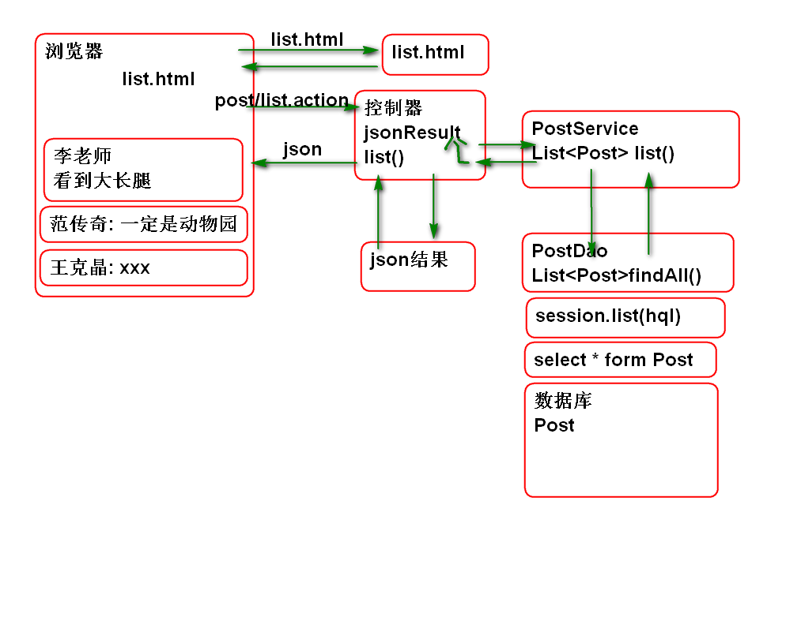

# SSH

## Hibernate

### 主键生成规则

Hibernate 提供了主键生成器, 其封装了常见的主键生成规则:

1. SequenceGenerator
	- 利用序列生成主键, 适合: Oracle DB2
2. IncrementGenerator
	- 利用当前主键最大值加1生成主键, 适合所有数据库, 有集群并发安全问题.
3. UUIDGenerator
	- 利用UUID最为主键. 适合任何数据库
4. IdentityGenerator
	- 利用自增类型作为主键, 适合有自增类型的数据库: MySQL, SQL Server DB2 等

案例原型:

案例SQL:

	create table p_user(
		u_id int not null auto_increment,
		u_name varchar(100), 
		u_password varchar(100),
		u_nick varchar(50),
		u_reg_date timestamp,
		primary key(u_id)
	); 
	
	insert into p_user (u_id, u_name, 
		u_password, u_nick, u_reg_date)values
		(null, '李洪鹤', '123', '李大湿', now());
	
	create table p_post(
		p_id int not null auto_increment,
		user_id int,
		p_time timestamp,
		p_content varchar(800),
		primary key(p_id)
	);
	
	insert into p_post (p_id, user_id, p_time,
		p_content) values (null, 1, now(), 
		'今天早晨看到大长腿, 嘿嘿!');
		
	insert into p_post (p_id, user_id, p_time,
		p_content) values (null, 1, now(), 
		'今天天气不错, 晒吐露皮了!');
		
	create table p_comment(
		c_id int not null auto_increment,
		post_id int,
		c_name varchar(100),
		c_time timestamp,
		c_content varchar(800),
		primary key(c_id)
	);
	
	insert into p_comment ( c_id, post_id, 
		c_name, c_time, c_content) values 
		(null, 1, '范传奇', now(), 
		'在哪个动物玩呢?');
		
	insert into p_comment ( c_id, post_id, 
		c_name, c_time, c_content) values 
		(null, 1, '王克晶', now(), 
		'李老师动物凶猛呀!');
		
	insert into p_comment ( c_id, post_id, 
		c_name, c_time, c_content) values 
		(null, 1, '范传奇', now(), 
		'请李老师附湿一首!'); 
	
	
> 其中: c_id int not null auto_increment 就是MySQL中的自增类型

案例步骤: 

1. 编写实体类:

		public class PUser implements Serializable {
			private static final long serialVersionUID = -2723787919195549266L;
		
			private Integer id;
			private String name;
			private String password;
			private String nick;
			private Timestamp regDate;
			
			public PUser() {
			}
		
			public PUser(Integer id, String name, String password, String nick, Timestamp regDate) {
				super();
				this.id = id;
				this.name = name;
				this.password = password;
				this.nick = nick;
				this.regDate = regDate;
			}
		
			public Integer getId() {
				return id;
			}
		
			public void setId(Integer id) {
				this.id = id;
			}
		
			public String getName() {
				return name;
			}
		
			public void setName(String name) {
				this.name = name;
			}
		
			public String getPassword() {
				return password;
			}
		
			public void setPassword(String password) {
				this.password = password;
			}
		
			public String getNick() {
				return nick;
			}
		
			public void setNick(String nick) {
				this.nick = nick;
			}
		
			public Timestamp getRegDate() {
				return regDate;
			}
		
			public void setRegDate(Timestamp regDate) {
				this.regDate = regDate;
			}
		
			@Override
			public int hashCode() {
				final int prime = 31;
				int result = 1;
				result = prime * result + ((id == null) ? 0 : id.hashCode());
				return result;
			}
		
			@Override
			public boolean equals(Object obj) {
				if (this == obj)
					return true;
				if (obj == null)
					return false;
				if (getClass() != obj.getClass())
					return false;
				PUser other = (PUser) obj;
				if (id == null) {
					if (other.id != null)
						return false;
				} else if (!id.equals(other.id))
					return false;
				return true;
			}
		
			@Override
			public String toString() {
				return "PUser [id=" + id + ", name=" + name + ", password=" + password + ", nick=" + nick + ", regDate="
						+ regDate + "]";
			}
		
		}

2. 编写映射文件: PUser.hbm.xml

		<?xml version="1.0" encoding="UTF-8"?>
		<!DOCTYPE hibernate-mapping PUBLIC 
		    "-//Hibernate/Hibernate Mapping DTD 3.0//EN"
		    "http://www.hibernate.org/dtd/hibernate-mapping-3.0.dtd">
		<hibernate-mapping>
			<!-- /mapping/PUser.hbm.xml -->
			<class name="cn.tedu.entity.PUser"
				table="p_user">
				<id name="id" column="u_id"> 
					<!-- <generator class="org.hibernate.id.IdentityGenerator"/>-->
					<generator class="identity"/>
				</id>
				<property name="name" column="u_name" />
				<property name="password" 
					column="u_password" type="string"/>
				<property name="nick" column="u_nick"/>
				<property name="regDate" 
					column="u_reg_date"/>
			</class>
		</hibernate-mapping>

3. 测试案例:

		@Test
		public void testAddPUser(){
			long now = System.currentTimeMillis();
			PUser user = new PUser(null, 
				"范传奇", "123", "范萌萌", 
				new Timestamp(now));
			Session session = factory.openSession();
			Transaction tx=session.beginTransaction();
			Object id=session.save(user);//自动生成ID
			System.out.println(id);
			System.out.println(user); 
			tx.commit();
			session.close();
		}
		
	> 说明: 在数据库中可以看到插入的结果, 并且可以看到不需要设置ID, Hibernate就会生成对应的ID.

## 复杂关联查询:

Hibernate 提供了关联查询功能, 只需要进行标签配置, 就可以将对象关联的对象查询出来, 可以大大节省编码.

案例:

1. 编写实体类:

		public class Comment implements Serializable {
			private static final long serialVersionUID = -1277268959640830134L;
		
			private Integer id;
			private Integer postId;
			private String name;
			private Timestamp time;
			private String content;
			
			public Comment() {
			}
		
			public Comment(Integer id, Integer postId, String name, Timestamp time, String content) {
				super();
				this.id = id;
				this.postId = postId;
				this.name = name;
				this.time = time;
				this.content = content;
			}
		
			public Integer getId() {
				return id;
			}
		
			public void setId(Integer id) {
				this.id = id;
			}
		
			public Integer getPostId() {
				return postId;
			}
		
			public void setPostId(Integer postId) {
				this.postId = postId;
			}
		
			public String getName() {
				return name;
			}
		
			public void setName(String name) {
				this.name = name;
			}
		
			public Timestamp getTime() {
				return time;
			}
		
			public void setTime(Timestamp time) {
				this.time = time;
			}
		
			public String getContent() {
				return content;
			}
		
			public void setContent(String content) {
				this.content = content;
			}
		
			@Override
			public String toString() {
				return "Comment [id=" + id + ", postId=" + postId + ", name=" + name + ", time=" + time + ", content=" + content
						+ "]";
			}
		
			@Override
			public int hashCode() {
				final int prime = 31;
				int result = 1;
				result = prime * result + ((id == null) ? 0 : id.hashCode());
				return result;
			}
		
			@Override
			public boolean equals(Object obj) {
				if (this == obj)
					return true;
				if (obj == null)
					return false;
				if (getClass() != obj.getClass())
					return false;
				Comment other = (Comment) obj;
				if (id == null) {
					if (other.id != null)
						return false;
				} else if (!id.equals(other.id))
					return false;
				return true;
			}
		}
		

		public class Post implements Serializable{
			private static final long serialVersionUID = 4052088422727902898L;
			
			private Integer id;
			private PUser user;
			private String content;
			private Timestamp time;
			private Set<Comment> comments =
					new HashSet<Comment>();
			
			public Post() {
			}
		
			public Post(Integer id, PUser user, String content, Timestamp time, Set<Comment> comments) {
				super();
				this.id = id;
				this.user = user;
				this.content = content;
				this.time = time;
				this.comments = comments;
			}
		
			public Integer getId() {
				return id;
			}
		
			public void setId(Integer id) {
				this.id = id;
			}
		
			public PUser getUser() {
				return user;
			}
		
			public void setUser(PUser user) {
				this.user = user;
			}
		
			public String getContent() {
				return content;
			}
		
			public void setContent(String content) {
				this.content = content;
			}
		
			public Timestamp getTime() {
				return time;
			}
		
			public void setTime(Timestamp time) {
				this.time = time;
			}
		
			public Set<Comment> getComments() {
				return comments;
			}
		
			public void setComments(Set<Comment> comments) {
				this.comments = comments;
			}
		
			@Override
			public String toString() {
				return "Post [id=" + id + ", user=" + user + ", content=" + content + ", time=" + time + ", comments="
						+ comments + "]";
			}
		
			@Override
			public int hashCode() {
				final int prime = 31;
				int result = 1;
				result = prime * result + ((id == null) ? 0 : id.hashCode());
				return result;
			}
		
			@Override
			public boolean equals(Object obj) {
				if (this == obj)
					return true;
				if (obj == null)
					return false;
				if (getClass() != obj.getClass())
					return false;
				Post other = (Post) obj;
				if (id == null) {
					if (other.id != null)
						return false;
				} else if (!id.equals(other.id))
					return false;
				return true;
			}
			
		}
				
2. 编写映射文件 Comment.hbm.xml
	
		<?xml version="1.0" encoding="UTF-8"?>
		<!DOCTYPE hibernate-mapping PUBLIC 
		    "-//Hibernate/Hibernate Mapping DTD 3.0//EN"
		    "http://www.hibernate.org/dtd/hibernate-mapping-3.0.dtd">
		<hibernate-mapping>
			<class name="cn.tedu.entity.Comment"
				 table="p_comment">
				<id name="id" column="c_id">
				 	<generator class="identity"/>
				</id>
				<property name="postId" column="post_id"/>
				<property name="name" column="c_name"/>
				<property name="time" column="c_time"/>
				<property name="content" column="c_content"/>
			</class>
		</hibernate-mapping>
			
3. 编写映射文件 Post.hbm.xml

		<?xml version="1.0" encoding="UTF-8"?>
		<!DOCTYPE hibernate-mapping PUBLIC 
		    "-//Hibernate/Hibernate Mapping DTD 3.0//EN"
		    "http://www.hibernate.org/dtd/hibernate-mapping-3.0.dtd">
		<hibernate-mapping>
			<class name="cn.tedu.entity.Post"
				 table="p_post">
				<id name="id" column="p_id">
				 	<generator class="identity"/>
				</id>
				<property name="time" column="p_time"/>
				<property name="content" 
					column="p_content"/>
				<!-- 映射 User 属性, 表示当前多个Post
				对象对应一个 User 对象 
				Hibernate 会自动的关联查询响应的数据-->
				<many-to-one name="user" 
					column="user_id"   
					class="cn.tedu.entity.PUser">
				</many-to-one>
				<!-- 读取回复信息的SET集合 
				从post角度看过去, 一个post对应多个回复-->
				<set name="comments" table="p_comment"
					 >
					<!-- key 标签用于指定在 p_comment
					表中的外键关联列名 -->
					<key column="post_id"/>
					<one-to-many class="cn.tedu.entity.Comment"/>
				</set>
			</class>
		</hibernate-mapping>

4. 测试:

		@Test
		public void testGetPost(){
			Session session = factory.openSession();
			Post post = (Post)session.get(Post.class, 1);
			System.out.println(post); 
			session.close();
		}
			
### 懒惰加载问题

Hibernate 默认情况下, 关联属性是懒惰加载的, 关联属性在访问时候才加载到内存中, 这样有利于减少SQL, 减少内存的消耗, 但是也有问题, 就是当Session关闭时候, 访问关联属性会出现懒惰加载异常的问题.

解决懒惰加载异常的两种方法:

1. 在映射文件中使用lazy=false属性, 这样Hibernate就会在加载数据时候立即加载关联属性. 但是这种方式也会增加内存的消耗.

		<!-- 映射 User 属性, 表示当前多个Post
		对象对应一个 User 对象 
		Hibernate 会自动的关联查询响应的数据-->
		<many-to-one name="user" 
			column="user_id" lazy="false" 
			class="cn.tedu.entity.PUser">
		</many-to-one>
		<!-- 读取回复信息的SET集合 
		从post角度看过去, 一个post对应多个回复-->
		<set name="comments" table="p_comment"
			lazy="false">
			<!-- key 标签用于指定在 p_comment
			表中的外键关联列名 -->
			<key column="post_id"/>
			<one-to-many class="cn.tedu.entity.Comment"/>
		</set>

2. 在Web项目中使用 OpenSessionInViewFilter  在View层中打开和关闭Session, 这样在访问关联属性时候Session就一定是打开的,不会发生异常.

		  <filter>
		    <display-name>OpenSessionInViewFilter</display-name>
		    <filter-name>OpenSessionInViewFilter</filter-name>
		    <filter-class>org.springframework.orm.hibernate4.support.OpenSessionInViewFilter</filter-class>
		  </filter>
		  <filter-mapping>
		    <filter-name>OpenSessionInViewFilter</filter-name>
		    <url-pattern>/*</url-pattern>
		  </filter-mapping>

### Ajax案例

1. 开发DAO

		public interface PostDao {
			List<Post> finaAllPost();
		}
		
		@Repository("postDao")
		@Transactional
		public class PostDaoImpl implements PostDao {
			
			@Resource(name="hibernateTemplate")
			private HibernateTemplate template;
			
			public List<Post> finaAllPost() {
				String hql="from Post";
				List<Post> list=(List<Post>)
						template.find(hql);
				return list;
			}
		}

2. 开发业务层:

		public interface PostService {
			List<Post> list();
		}
		
		@Service("postService")
		@Transactional
		public class PostServiceImpl 
			implements PostService{
		
			@Resource
			private PostDao postDao;
			
			public List<Post> list() {
				return postDao.finaAllPost();
		 	}
		}

3. 开发控制器:
		
		public abstract class AbstractAction 
			extends ActionSupport{
			
			public static final String JSON="json";
			
			protected JsonResult jsonResult;
			
			public JsonResult getJsonResult() {
				return jsonResult;
			}
			public void setJsonResult(JsonResult jsonResult) {
				this.jsonResult = jsonResult;
			}
		}
		
		
		@Controller
		@Scope("prototype")
		public class PostAction 
			extends AbstractAction{
			@Resource
			private PostService postService;
			public String list(){
				List<Post> list=postService.list();
				jsonResult=new JsonResult(list);
				return JSON;
			}
		}

4. 配置控制器 struts.xml

		<package name="post" namespace="/post"
			extends="json-default">
			<action name="list" class="postAction"
				method="list">
				<result name="json" type="json">
					<param name="root">jsonResult</param>
				</result>
			</action>
		</package>

5. 测试:

		http://localhost:8080/ssh/post/list.action

6. 开发客户端: list.html

		<!DOCTYPE html>
		<html>
		<head>
		<meta charset="UTF-8">
		<title>发帖列表</title>
		
		
		</head>
		<body>
			<h1>好友圈</h1>
			

				<h2>今天看到大长腿</h2>
				<h3>2017-8-9 李老师</h3>
				<ul>
					<li>范传奇
					取动物园了吧!</li>
				</ul>		
			

		</body>
		</html>

7. 测试

-----------------------------

## 作业

1. 实现SSH AJAX 版本的 Post 列表

